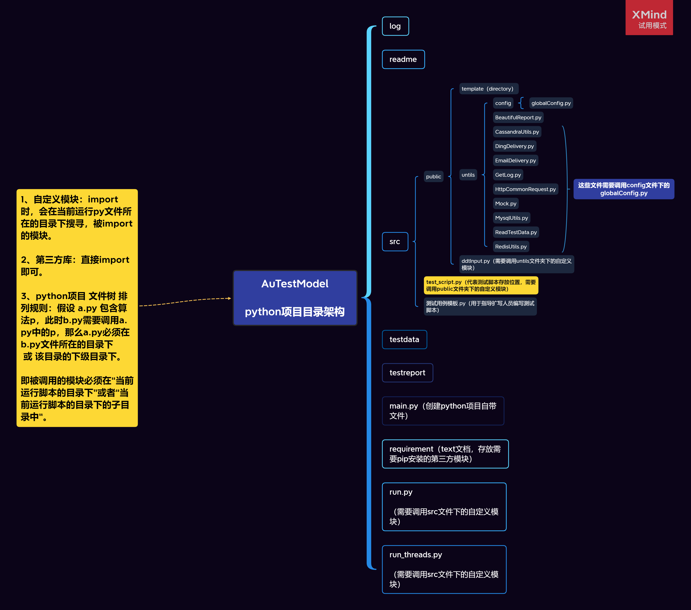
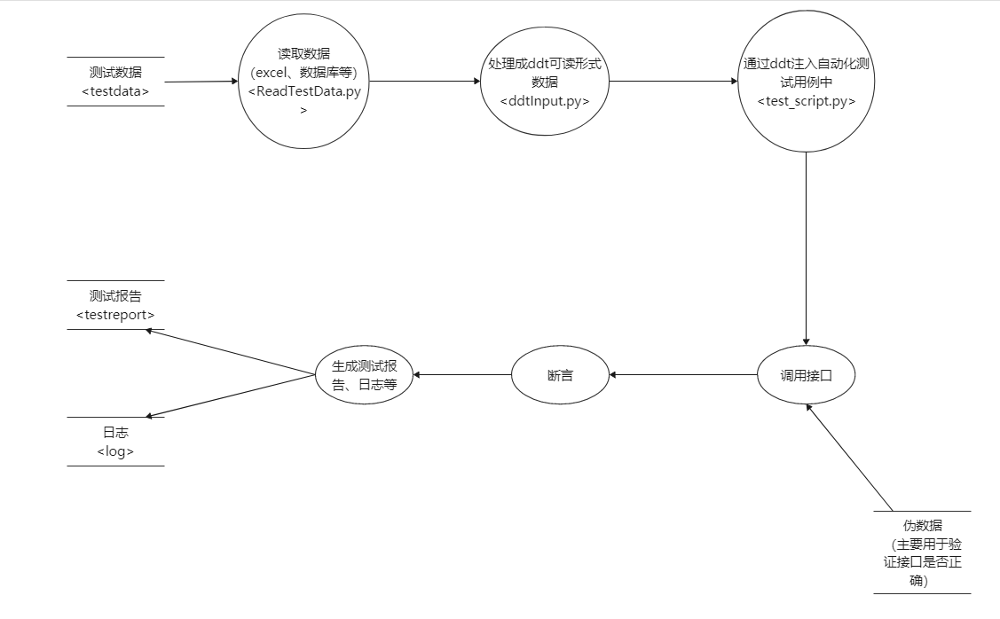
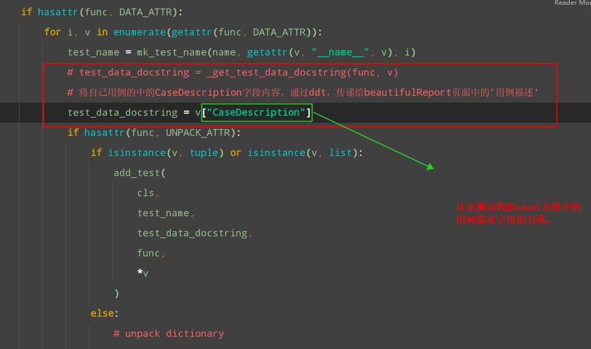
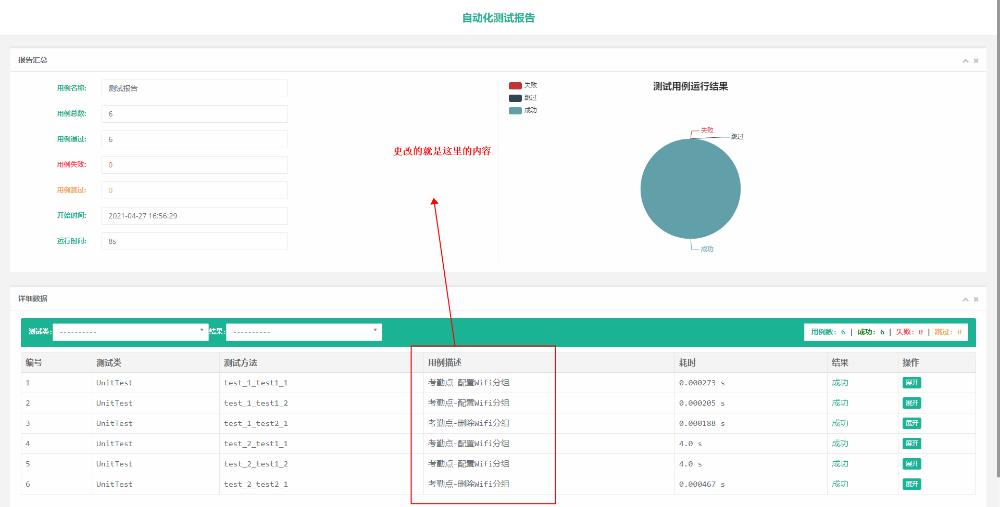
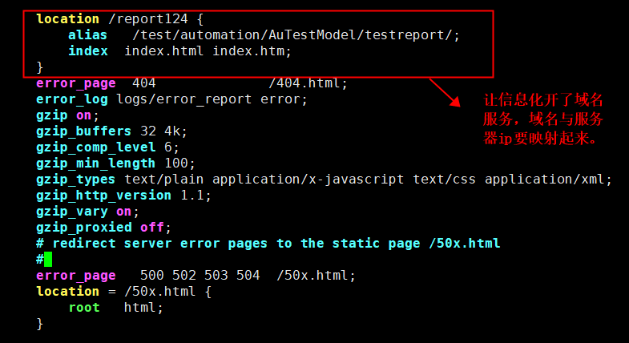

# 										自动化测试模板搭建与使用说明

## 作者：朱宽（zhu kuan）


## 一、框架简述

### 1.1 框架使用范围

1、本框架适用于 http接口自动化测试、单元自动化测试等。

### 1.2 框架功能

1、主要功能有：自动化测试、发送自动化测试报告url、操作数据库、读取excel（.xlsx）、采用ddt进行数据驱动、保存日志等。


## 二、框架结构与数据流程图





### 2.1 log文件夹

1、该文件夹主要存储每一次执行的日志文件。日志文件以 年-月-日-时-分-秒 命名。

### 2.2 readme

1、ReadMe.md文件对框架进行说明。

2、picture文件夹存储ReadMe.md文件中的图片。

### 2.3 src文件夹

#### 2.3.1 public文件夹

##### 2.3.1.1 template文件夹

1、BeautifulReport必用文件。

2、发送测试报告url连接后，加载极其缓慢。因此修改了template模板文件中的资源加载路径。（详情请看使用框架前置条件）

##### 2.3.1.2 untils文件夹

1、config——globalConfig.py  该文件夹主要存储全局配置信息。主要有：当前文件所在目录的父目录的绝对路径、测试数据存储位置、日志文件存储位置、测试报告存储位置、http请求地址和端口、数据库相关信息等。

2、BeautifulReport.py  测试报告模板，与template配合使用。

3、CassandraUtils.py  操作Cassandra数据库的公共模块。

4、DingDelivery.py  将测试报告url发送至钉钉机器人。需要搭建服务器（nignx），详情请在框架使用前置条件中查看。

5、EmailDelivery.py  将测试报告url或测试报告通过邮件发送。（未编写代码，如有需要请自行编写）

6、GetLog.py  日志公用模块。

7、HttpCommonRequest.py  存储http请求，公用部分。（如有其他需求请自行扩写）

8、Mock.py  这是模拟模块，在开发人员未完成开发时，进行自动化测试用例编写时使用。适用于前置测试模型。

9、MysqlUtils.py  操作Mysql数据库的公共模块。

10、ReadTestData.py  实现了从excel中读取数据、处理数据的功能。（输出字典型数据）

11、RedisUtils.py  操作Redis数据库的公共模块。

##### 2.3.1.3 ddtInput.py

1、ddtInput.py  实现了给自动化测试用例传递指定TestCaseFlag的多组测试数据的功能。目前只实现了ddt+excel进行驱动；未实现ddt+数据库进行驱动。

##### 2.3.1.4 dynamicData.py

1、dynamicData.py 主要用于提取动态数据，类似于cookie等。

#### 2.3.2 test_script.py

1、测试脚本存放位置，需要调用public文件夹下的自定义模块。（注：编写测试脚本完成后，放在次位置即可）

2、测试脚本命名规则：test*.py

#### 2.3.3 测试用例模板.py

1、用于指导自动化测试人员编写测试脚本。

### 2.4 testdata文件夹

1、主要存储测试数据，即接口等需要传入的参数数据。采用excel表格存储。

2、如果不清楚存储数据的字段含义，请在本框架的TestData>接口数据模板解析 文件夹下进行查看。

### 2.5 testreport文件夹

1、存储 测试报告.html。

### 2.6 main.py

1、用pycharm创建python项目自带的文件，不必理会。

### 2.7 requirement

1、text文档，存放需要pip安装的第三方模块。

### 2.8 run.py

1、单线程运行本框架。

### 2.9 run_threads.py

1、多线程运行本框架，限于测试报告模块，功能可能不是很稳定，未查出原因，尽量少用。

2、不稳定现象为多线程运行时，不能按照文件加载顺序填入测试报告中。如需改进，涉及BeautifulReport源码部分，目前笔者能力不足，无法修改。


## 三、使用框架前置条件

### 3.1 测试报告模板准备与修改

==（框架已完成--无需操作本步骤）==

#### 3.1.1 下载BeautifulReport模块

1、解压后，取出 BeautifulReport.py  放入项目的 ==src/public/untils/BeautifulReport.py==  这个目录下。

2、取出 template文件夹下的 template HTML模板文件，在项目的 ==src/public/template==下创建Directory文件夹，名称为template。

#### 3.1.2 修改 template 文件

==（主要解决前端资源加载缓慢的问题）==

```html
<link href="https://cdn.bootcdn.net/ajax/libs/twitter-bootstrap/3.3.5/css/bootstrap.min.css" rel="stylesheet">
<link href="https://cdn.bootcdn.net/ajax/libs/font-awesome/4.4.0/css/font-awesome.min.css" rel="stylesheet">
<link href="https://cdn.bootcdn.net/ajax/libs/animate.css/3.5.2/animate.min.css" rel="stylesheet">
<link href="https://cdn.bootcdn.net/ajax/libs/chosen/1.8.2/chosen.css" rel="stylesheet">
```

1、将template文件中的前端资源加载路径修改为国内的。链接为：[BootCDN - Bootstrap 中文网开源项目免费 CDN 加速服务](https://www.bootcdn.cn/)

2、如果使用浏览器通过url打开测试报告时，首次加载缓慢的话，请按==F12==，点击==network==，查看是哪个前端资源加载缓慢。然后在template文件中按==Ctrl+F==查找这些加载的前端资源的url，然后在[BootCDN - Bootstrap 中文网开源项目免费 CDN 加速服务](https://www.bootcdn.cn/)中查找相关的版本的前端资源更换加载url即可解决。

### 3.2 ddt模块源码修改

==（框架已完成--无需操作本步骤）==

1、打开==ddt.py==文件，找到下列代码进行修改，实现BeautifulReport模板的测试报告的用例描述的重新定义，即对应excel的测试数据中用例描述那一列。

```python
for name, func in list(cls.__dict__.items()):
    if hasattr(func, DATA_ATTR):
        for i, v in enumerate(getattr(func, DATA_ATTR)):
            test_name = mk_test_name(name, getattr(v, "__name__", v), i)
            # test_data_docstring = _get_test_data_docstring(func, v)
            # 将自己用例的中的CaseDescription字段内容，通过ddt，传递给beautifulReport页面中的’用例描述‘
            test_data_docstring = v["CaseDescription"]
            if hasattr(func, UNPACK_ATTR):
                if isinstance(v, tuple) or isinstance(v, list):
                    add_test(
                        cls,
                        test_name,
                        test_data_docstring,
                        func,
                        *v
                    )
```






### 3.3 nginx安装与配置--远程查看测试报告

==（在部署本自动化测试框架的Linux服务器上安装Nginx）==

1、[Linux安装nginx详细步骤教程！_在云端-CSDN博客_linux安装nginx详细教程](https://blog.csdn.net/wjhgaodandan/article/details/105644288)

2、[Nginx安装及配置文件详解（Linux版本） - 简书 (jianshu.com)](https://www.jianshu.com/p/e64539590865)

3、[[nginx\]-nginx root 和 alias 配置区别_爷来辣的博客-CSDN博客](https://blog.csdn.net/xujiamin0022016/article/details/86694589)

4、本项目配置截图



### 3.4 在Linux服务器安装==python3==环境

#### 3.4.1 安装python3

1、[在Linux上安装Python3 - lemon锋 - 博客园 (cnblogs.com)](https://www.cnblogs.com/lemon-feng/p/11208435.html)

#### 3.4.2 安装第三方库

1、在3.4.1完成后，使用==pip3==按照本框架中的==AuTestModel\requirement==文件安装需要的第三方库。

## 四、框架使用

1、将编写好的自动化测试脚本放在==AuTestModel\src\public==目录下。

​	==（不要乱放，否则import时，会产生错误）==

2、自动化测试脚本命名规则：test*.py

3、自动化测试脚本编写模板请看：AuTestModel\src\测试用例模板.py

4、自动化测试用例编写思路如下：

​	（1）file_name：测试数据名称；测试数据放在testdata文件下；测试数据模板请看“接口数据模板解析”，==AuTestModel\testdata\接口数据模板解析==。

​	（2）如果自动化测试用例有共同的前置条件，那么放在setUp()函数中。

​	（3）构造伪数据，调用接口，断言即可完成一条自动化测试用例的编写。

​	（4）本框架是基于数据驱动的，因此一条自动化测试用例可以注入相关的多条测试数据，并且测试报告中是按照测试数据的条数进行统计的。

5、执行框架命令：

Linux环境-->python3 /auto-test-model/run.py

windows环境-->python /auto-test-model/run.py

==路径可使用绝对路径或相对路径==

## 五、扩展建议

1、扩写的工作组件请放在：==AuTestModel\src==文件夹下；请按照python默认的import模式合理存放自己扩写的模块。

2、python默认的import模式：python项目 文件树 排列规则：假设 a.py 包含算法p，此时b.py需要调用a.py中的p，那么a.py必须在 b.py文件所在的目录下 或 该目录的下级目录下。即==被调用的模块==必须在==“当前运行脚本的目录下”==或者==“当前运行脚本的目录下的子目录中”==。


## 六、框架不足之处

1、多线程运行本框架，限于测试报告模块，功能可能不是很稳定，未查出原因。

2、如有其它优化建议请发送至笔者的邮箱：zhu.kuan@qq.com
